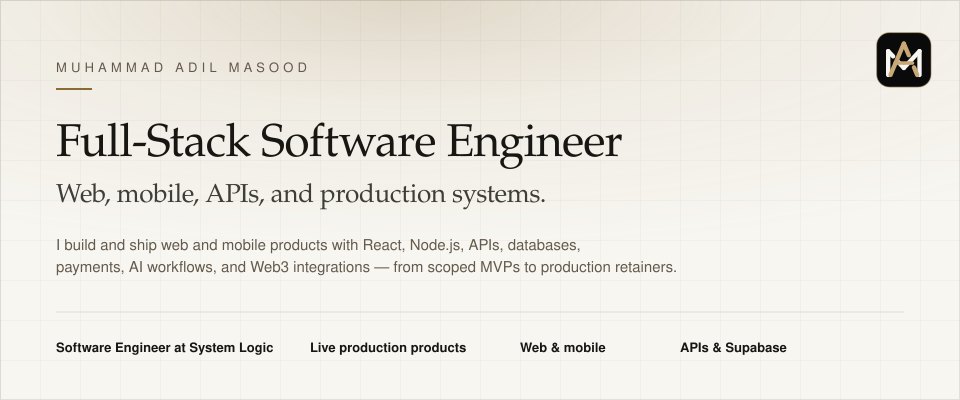

<picture>
  <source media="(prefers-color-scheme: dark)" srcset="./assets/banner-dark.svg">
  
</picture>

 

[Portfolio](https://adilmasood.dev) &nbsp;&nbsp;·&nbsp;&nbsp; [LinkedIn](https://www.linkedin.com/in/adil-masood) &nbsp;&nbsp;·&nbsp;&nbsp; [Email](mailto:adilmasood17409@gmail.com)

## Featured work

Live production products across fintech, Web3, AI, and civic systems.

**01 — COOWN** · FinTech / Treasury  
Treasury infrastructure for SMEs and startups — accounts, approvals, governance, invoicing, and regulated euro rails.  
[Live](https://coown.finance/) · [Case study](https://adilmasood.dev/projects/coown)

**02 — Nadriverzum** · Web3 / Community / Mobile  
React web and Expo mobile for a community network — galaxies, messaging, and ICRC-1 tokens on the Internet Computer.  
[Live](https://nadriverzum.org/) · [Case study](https://adilmasood.dev/projects/nadriverzum)

**03 — VoiceCraft** · AI / Voice / SaaS  
Browser-based AI suite for transcripts, summaries, scripts, and audio — 28 tools, local-first, in production.  
[Live](https://www.voicecrafttool.com) · [Case study](https://adilmasood.dev/projects/voicecraft)

**04 — CivicResolve** · Civic Tech / Full-Stack  
Role-based civic complaint platform — citizens track cases while teams run assignment, SLA, and audit workflows.  
[Demo](https://civic-resolve-one.vercel.app/) · [Case study](https://adilmasood.dev/projects/civicresolve)

**05 — VocalFusion** · AI / Voice / Media  
AI voiceover generation for multilingual speech, video synchronization, and a single web workflow.  
[Case study](https://adilmasood.dev/projects/vocalfusion)

## Stack

**Frontend** · React · Next.js · TypeScript · Tailwind CSS

**Backend** · Node.js · Express · REST APIs

**Data** · Supabase · PostgreSQL · MongoDB · MySQL

**Payments** · Stripe

**Web3** · Motoko · Internet Computer · ICRC-1

**Mobile** · React Native · Expo

## Now

Software Engineer at **System Logic**, Faisalabad. Shipping production React web applications, Expo mobile clients, and API integrations.

Open for product builds and remote contracts.

[adilmasood.dev](https://adilmasood.dev)

